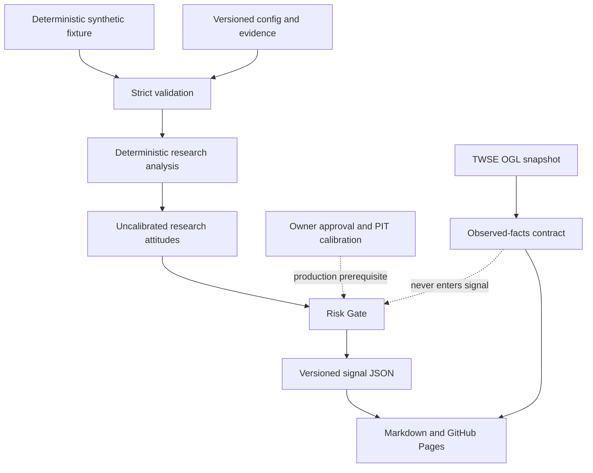

# StockmarketAgent｜台灣・日本・美國股票研究儀表板

[](https://github.com/trionnemesis/StockmarketAgent/actions/workflows/quality.yml)
[](https://github.com/trionnemesis/StockmarketAgent/actions/workflows/deploy-pages.yml)


> 將台灣、日本、美國 30 個候選標的的證據審查、確定性分析與多期間研究態度，整理成可重建、可追溯的 GitHub Pages 研究原型。

**[開啟 GitHub Pages](https://trionnemesis.github.io/StockmarketAgent/)** · [2330 台積電官方資料快照](https://trionnemesis.github.io/StockmarketAgent/instruments/tsmc.html) · [Universe 證據審查](https://trionnemesis.github.io/StockmarketAgent/universe-review.html) · [來源可行性](https://trionnemesis.github.io/StockmarketAgent/source-feasibility.html) · [研究方法](https://trionnemesis.github.io/StockmarketAgent/methodology.html) · [驗證紀錄](VERIFICATION.md)


## Why

跨市場研究不能只顯示一個方向性標籤。StockmarketAgent 將候選 Universe、總體經濟、基本面、估值、技術面、循環與事件拆成可驗證欄位，再由版本化設定產生 1W／1M／3M／12M 的研究態度與風險理由。JSON 是唯一事實來源；Markdown 與靜態 HTML 只呈現同一份通過契約驗證的結果。

目前完整分析路徑使用 **deterministic synthetic research snapshot**。研究頁可出現 `BUY`、`HOLD`、`SELL`、`NO_SIGNAL`，但這些態度尚未完成 point-in-time（PIT）回測與校準，不能解讀為正式投資訊號。2330 台積電頁另有一條完全分流的 **TWSE 官方 OGL observation snapshot**：它只呈現日期、價格、估值、月營收與季度財務事實，不會進入分數或態度。Risk Gate、Universe approval 與 production gate 仍然有效。

> **研究邊界：分數與態度是未校準的合成資料研究輸出；另行標示的 TWSE 官方快照不是即時報價，也不會升級為投資訊號或交易指令。**

## 研究原型功能

| Slice | 已完成的研究能力 | 關鍵邊界 |
|---|---|---|
| Universe | 台／日／美各 5 個股 + 5 ETF，共 30 個候選；逐筆保存 listing、代號、交易場所、幣別、資產類型與選擇理由 | 30 個標的仍為 `proposed`、`disabled`，尚未取得 Owner 核准 |
| Evidence review | 15 個 ETF tracking index、37 筆來源紀錄、6 組重疊與 issuer concentration 可供 Pages 閱讀 | reference metadata 不等於可用行情、PIT 歷史或再發布授權 |
| 2330 official facts | TWSE OpenAPI 的 EOD、估值、月營收、一般業綜合損益與資產負債共 5 個 OGL 資源；保存正規化事實、來源 URL、response hash、取得時間與顯名聲明 | `used_in_signal=false`、自動排程關閉；不宣稱完整 PIT history、correction stream 或即時報價 |
| Deterministic analysis | 以固定 synthetic fixture 計算 macro、fundamental、valuation、technical、cycle、events 研究元件 | 不包含 live provider observations；數值只供管線、契約與呈現驗證 |
| Research attitudes | 1W／1M／3M／12M 可呈現 `BUY`、`HOLD`、`SELL`、`NO_SIGNAL`、信心、支持／反向證據與失效條件 | 態度為 `uncalibrated` research output，不是 production signal |
| Risk Gate | 保留風險旗標、資料品質與核准狀態，阻止研究輸出被提升為正式訊號 | `production_signal_enabled` 維持 `false`；不因研究態度出現方向就放行 |
| Traceability | Strict JSON Schema、來源 manifest、input hash、可解析的 Git source revision、immutable run、latest/archive、Markdown 與 HTML | Renderer 不重算模型；人工修改產出不會成為事實來源 |
| Static delivery | 首頁、三市場、30 個標的、方法、狀態、歷史與證據頁部署至 GitHub Pages | 靜態網站不接收 credentials，也不提供券商下單或自動交易 |

## 資料流程



相同 fixture、設定與程式版本會產生相同核心輸出。每個新研究 run 的 `git_sha` 指向最近一次修改 `config/`、`data/observations/`、`schemas/`、`src/` 或 `tests/fixtures/` 的完整 Git commit；`input_hash` 再綁定實際輸入與 build fingerprint。Pipeline 先在 staging 完整產生檔案並執行 preflight，再以 rollback-aware promotion 更新輸出；GitHub Pages workflow 只有在 build 與測試通過後才上傳完整 artifact。

## 快速開始

需求：Python 3.11+。一般研究 build 不連外、不需第三方套件、API key 或資料供應商帳號。只有人工更新 2330 官方快照時才會依序呼叫 5 個文件化 TWSE OpenAPI 端點。

```bash
git clone https://github.com/trionnemesis/StockmarketAgent.git
cd StockmarketAgent

python3 -m src.pipeline build
python3 -m src.pipeline validate
python3 -m unittest discover -s tests -p 'test_*.py' -v

python3 -m http.server 8765 --directory docs
```

開啟 `http://127.0.0.1:8765/`。重新執行相同版本的 build，應得到相同的核心 JSON 與 input hash。

人工更新台積電官方資料快照：

```bash
python3 -m src.ingestion.twse_openapi
python3 -m src.pipeline build
python3 -m src.pipeline validate
```

擷取器會宣告 User-Agent、逐一請求、每次至少間隔 2 秒，且只走 Swagger 所列 OpenAPI。TWSE 一般網站條款禁止未經同意的 HTML 爬蟲，因此 MOPS／TWSE HTML 頁、Yahoo Finance 與 `yfinance` 都不在這條資料路徑。API 數值上線前仍需人工檢視 diff。

## CLI

| Command | 用途 |
|---|---|
| `python3 -m src.pipeline build` | 驗證 versioned config 與 synthetic fixture，產生 signal、run record、Markdown 與 Pages artifact |
| `python3 -m src.pipeline validate` | 驗證既有 latest、archive、Pages JSON 與 Agent Run 契約一致性 |
| `python3 -m src.ingestion.twse_openapi` | 手動擷取 2330 的 5 個 TWSE OGL 資源，正規化後原子寫入 observation snapshot；不啟用排程或訊號 |
| `python3 -m unittest discover -s tests -p 'test_*.py' -v` | 執行 contract、integration、link、consistency 與 secret-pattern tests |
| `python3 -m http.server 8765 --directory docs` | 在本機預覽生成後的 GitHub Pages 靜態網站 |

## 公開頁面

| Route | 內容 |
|---|---|
| [`/`](https://trionnemesis.github.io/StockmarketAgent/) | 三市場摘要、研究態度、Risk Gate 與 evidence review 入口 |
| `/markets/tw.html` | 台灣 5 個股 + 5 ETF 的研究摘要 |
| `/markets/jp.html` | 日本 5 個股 + 5 ETF 的研究摘要 |
| `/markets/us.html` | 美國 5 個股 + 5 ETF 的研究摘要 |
| [`/instruments/tsmc.html`](https://trionnemesis.github.io/StockmarketAgent/instruments/tsmc.html) | 2330 官方 OGL 快照與完全分流的 synthetic 多期間研究態度 |
| `/instruments/<slug>.html` | 其餘候選標的的多期間態度、研究元件、風險與來源 |
| `/universe-review.html` | 逐檔 listing、ETF index、歷史、流動性、重疊與模型適用性審查 |
| `/source-feasibility.html` | 37 筆來源紀錄與採用、條件式使用、阻擋理由 |
| `/methodology.html` | 分數、研究態度、Risk Gate、限制與非目標 |
| `/status.html` | 執行模式、資料種類、缺失條件與 production 狀態 |
| `/history.html` | 可追溯的歷史研究快照 |
| `/data/latest.json` | 網站使用的最新 strict signal JSON |
| `/data/universe-review.json` | Universe evidence review 的機器可讀版本 |
| `/data/sources.json` | Source feasibility 的機器可讀版本 |
| `/data/observations/tsmc.json` | 2330 官方 observation snapshot、授權、response hashes 與正規化事實 |

## 資料信任邊界

- 分數與研究態度的輸入仍是固定、可重現的 synthetic research fixture；它不讀取台灣、日本或美國市場的行情、財報、新聞或 ETF holdings。
- 2330 頁的官方 observation snapshot 是獨立資料產品，只採用 TWSE OpenAPI 對應的政府開放資料；`used_in_signal=false`、`automated_refresh_enabled=false`。
- 30 個標的全部維持 `proposed`、`disabled`；evidence review 完成不代表 Owner 已核准正式 Universe。
- `BUY`、`HOLD`、`SELL`、`NO_SIGNAL` 是未校準研究態度。Risk Gate 明確阻止它們成為 production signal。
- Repository 未啟用 live adapters、外部 provider credentials 或排程；唯一提交的 provider facts 是具有 OGL 顯名與 Pages 再發布依據的 2330 正規化快照。
- 不執行券商下單、自動交易、個人資產配置或報酬保證。
- JSON 是唯一事實來源；Renderer 只讀取已驗證 JSON，不從 HTML、Markdown 或 LLM 回推分數與態度。
- 資料不足、契約不符或 gate 未通過時，系統不得用空值冒充有效觀測，也不得把研究結果提升為正式訊號。
- Secrets 只能在未來經核准的執行環境注入，不得提交 Repository、寫入 artifact 或傳送到瀏覽器。
- 下一個 production gate 必須先確認 external-display／redistribution rights，並以可追溯的 PIT dataset 完成回測、校準與核准。

完整產品與資料契約見 [SPEC.md](SPEC.md)，候選清單與核准條件見 [Universe proposal](docs/universe-proposal.md)，參考資料採用／排除界線見 [references/README.md](references/README.md)，Owner 決策討論見 [Issue #1](https://github.com/trionnemesis/StockmarketAgent/issues/1)。

## Repository anatomy

```text
config/                 Universe、evidence、source、benchmark、threshold 與 approval 設定
schemas/                Universe、signal、event、source、review 與 Agent Run strict contracts
src/validation/         零第三方依賴的 schema 與 domain validation
src/render/             Markdown 與 static HTML renderer
src/pipeline.py         deterministic build、preflight、promotion 與 validate CLI
tests/fixtures/          固定、非 live 的 synthetic research inputs
data/observations/       官方 OGL observation snapshots；與 signal input 分流
src/ingestion/           手動、低頻、政策受控的官方 OpenAPI 擷取與正規化
signals/                latest、date archive 與 immutable run JSON
reports/                latest、date archive 與 immutable run Markdown
agent-runs/              可重現的 execution records
docs/                   GitHub Pages 靜態成品與公開 JSON
.github/workflows/      Quality 與 Pages deployment gates
SPEC.md                 完整產品／資料契約
VERIFICATION.md         本地與遠端驗證證據
```

## Evidence review 與 Owner 決策

| Evidence | 目前結果 | 尚未證明的事項 |
|---|---:|---|
| 候選標的 | 30 / 30 已審查；其中 9 筆 metadata 或 theme 經修正 | Owner 尚未核准 production Universe |
| ETF tracking index | 15 / 15 已獨立保存 | 不等同市場績效 benchmark series 已選定 |
| Source records | 37 | 其中 TWSE OGL 已完成 2330 最小 observation slice；其餘不等同已整合 provider、取得 credentials 或再發布權 |
| Live age 未滿五年 | 2：00919、00965 | `sufficient` 也不代表已有同長度可用 PIT history |
| 流動性 | 30 / 30 為 `quantitative_review_pending` | 成交額、價差、容量門檻仍待獲授權資料量化 |
| 明確重疊 | 6 組 | wrapper 與 look-through 上限尚未決定 |
| ETF issuer concentration | 台灣 Yuanta 2 / 5；日本 Nomura 3 / 5；美國無重複 issuer | 可接受的 issuer concentration 上限尚未決定 |
| Owner decisions | 7 | 全部仍待決策 |

Owner 尚需決定：

1. 是否接受本次名稱、交易所與主題修正。
2. 0050／006208 與 1306／1475 是否各只保留一個重複 index wrapper。
3. 是否允許 live age 未滿五年的 00919、00965。
4. 三市場 benchmark 應採 price、total-return 或 net-return 哪一條精確 series。
5. 是否取得並核准 live、歷史、corporate actions、ETF holdings 與 benchmark 的資料使用及外部展示權。
6. 最低成交額、最大價差、issuer concentration 與 look-through overlap 門檻。
7. 是否核准個股、ETF 與金融股的模型 routing。

## 目前狀態

| Capability | 狀態 | 依據與邊界 |
|---|---|---|
| Deterministic research pipeline | 已啟用 | 使用 synthetic fixture，可重建並通過 strict contract |
| Research components and attitudes | 已啟用 | 僅為未校準 research output；可包含 `BUY`／`HOLD`／`SELL`／`NO_SIGNAL` |
| Risk Gate | 已啟用 | `production_signal_enabled` 維持 `false`，不放行正式訊號 |
| GitHub Pages | 已啟用 | 發布生成後的靜態 HTML 與公開 JSON |
| Universe evidence review | 30 / 30 已完成 | 仍有 7 項 Owner decisions，全部標的維持 proposed／disabled |
| 2330 official observation | 已啟用手動快照 | 5 個 TWSE OGL 資源；不進入訊號、不自動排程、不提供完整 PIT history |
| Live adapters and scheduled provider data | 未啟用 | Repository 沒有 live credentials、排程或 production routing |
| PIT backtest and calibration | 未完成 | 研究態度不得視為已驗證的預測能力 |
| Production signals and trading | 未啟用 | 沒有正式 BUY／SELL、券商 API 或自動下單 |

正式資料功能必須以獨立、可審查的 PR 推進。下一個高優先缺口是建立 2330 可重播的歷史 snapshot／revision archive，再補 TAIEX 精確 benchmark 與 corporate actions；Owner 決策、完整 PIT dataset、回測與校準未完成前，系統維持 `research_only`。
